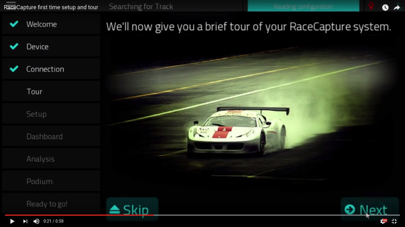
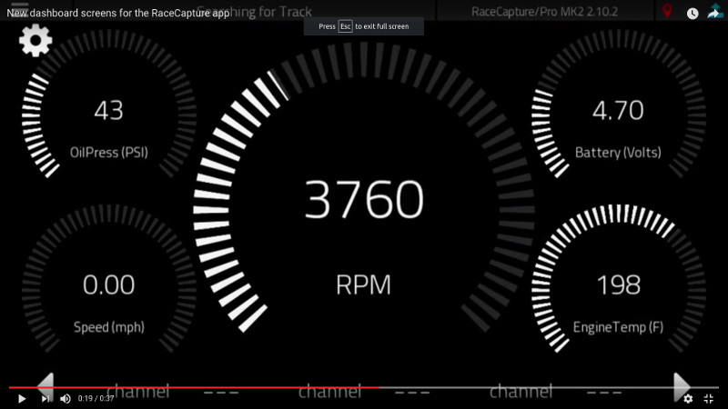
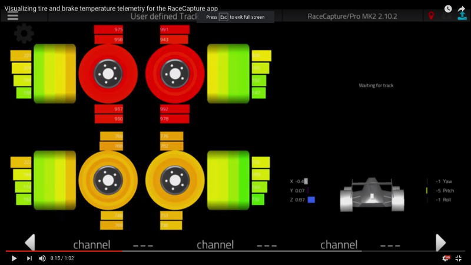
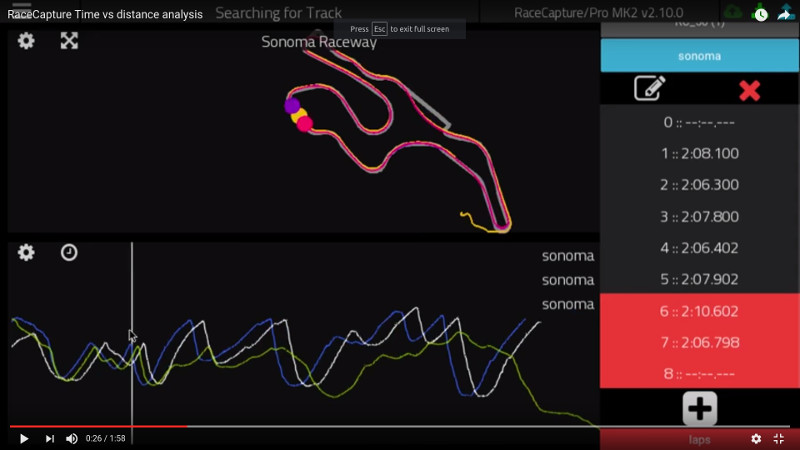
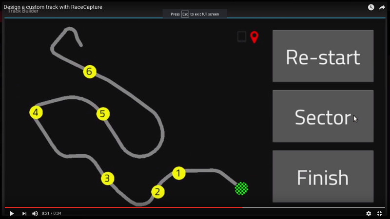

RaceCapture App
===============

RaceCapture is the companion app for the [RaceCapture family of motorsport telemetry systems](https://github.com/autosportlabs/RaceCapture_App). 

It includes:

* A powerful, configurable dashboard;
* Full configuration for the RaceCapture hardware;
* Built-in analysis features;
* The ability to live-stream to http://podium.live.

## Multi Platform Support
We actively support 6 platforms, including the Raspberry Pi.

Latest releases:
* OS X: http://podium.live/software
* Windows: http://podium.live/software
* iOS: https://itunes.apple.com/us/app/racecapture/id1162797255
* Android: https://play.google.com/store/apps/details?id=com.autosportlabs.racecapture&hl=en
* Amazon App Store: https://www.amazon.com/Autosport-Labs-Race-Capture/dp/B016ZJM7GE
* Raspberry Pi: http://podium.live/software (Setup guide: https://wiki.autosportlabs.com/RaceCapture_on_Raspberry_Pi)

## Video demos
Click the following for a tour of the RaceCapture App:

 

CAN bus mapping presets

Analog sensor channel configuration

Track Map Library

Lua Scripting Editor

 
## dev installation (OS X)

1. Install latest of python 2.x
1. Confirm you have the latest version of homebrew, setuptools and pip installed
1. Install kivy 1.10.0 
- > Follow the "Install with Kivy.app" approach https://kivy.org/docs/installation/installation-osx.html
1. Activate virtual environment
- > `cd /Applications/Kivy.app/Contents/Resources/venv/bin` && `source activate`
1. Navigate to the RaceCapture_App source directory
1. Install dependencies: `pip install -r requirements.txt`
1. Run the RaceCapture app: `python main.py`

## Preparing to build installers (OSX)

1. Make sure all dependencies are installed inside Kivy's venv 
1. `cd /Applications/Kivy.app/Contents/Resources/venv/bin` && `source activate`
1. `cd /path/to/RaceCapture_App` && `pip install -r requirements.txt`
1. If we're using a custom build of Kivy, we need to fix the paths for some libraries, run the install/osx/fix-osx-paths.sh script.

## Creating installer for current version (OSX)
1. `cd install/osx`
1. `./build-osx.sh`

The script will create the .App file and .dmg for distribution.

## installation (Win7/8/10)

1. Install x86 2.7.x Python and kivy via instuctions https://kivy.org/docs/installation/installation-windows.html
1. Navigate to the RaceCapture source directory
1. Install RaceCapture requirements: `pip install -r requirements.txt`

## running (Win7/8/10)

1. Navigate to the RaceCapture source directory
1. Launch RaceCapture `python main.py`

## IDE installation (Eclipse on Win7, but probably applies to Eclipse on any platform)

1. Do the "installation" instructions above
1. Download [Eclipse] (https://www.eclipse.org/downloads/)
1. Install [PyDev for Eclipse] (http://pydev.org/manual_101_install.html) and use auto-config
1. In Window..Preferences..PyDev..Interpreter..Python Interpreter..Environment, add a variable "PATH" with value c:\kivy;c:\kivy\Python;c:\kivy\gstreamer\bin;c:\kivy\MinGW\bin;%PATH%
1. In Window..Preferences..PyDev..Interpreter..Python Interpreter..Forced Builtins, add "kivy" to the list
1. Make a new project in Eclipse, select "PyDev project" and specify the folder with Racecapture in it
1. Right-click the project...Properties...pyDev-PYTHONPATH...External Libraries - Add source folder, add my_kivy_install_folder\kivy
1. Run the project

## Create installer (Win7/8/10)

1. Prepare dev installation (above)
1. Install [nullsoft scriptable install system] (http://nsis.sourceforge.net/Download) stable version (currently 2.46)
1. Navigate command line to install subfolder of RaceCapture app directory
1. build_win_release.bat <major>.<minor>.<bugfix>
 
## dev installation (Linux - Ubuntu)

1. Install kivy 1.9.1 via pip
1. install [virtualenv]: `sudo pip install virtualenv`
1. create a virtual environment (perhaps in this directory): `virtualenv _ve`
1. activate the virtualenv: `. _ve/bin/activate`
1. install pip requirements: `sudo pip install -r requirements.txt` (you may be required to upgrade your version of setuptools via the provided command)
1. install asl_f4_loader in dependencies folder: pip install asl_f4_loader-X.X.X.tar.gz

## running (Linux - Ubuntu)

    python main.py

## dev installation (Raspberry Pi)
1. If installing on Raspberry Stretch you need Kivy Master (1.10.1) to work around window provider issue (see https://github.com/kivy/kivy/issues/5360)
1. Cython 0.23 required

## Buildozer android APK build/install (Linux only)

1. install buildozer from https://github.com/kivy/buildozer
1. from the root RaceCapture app directory, run ./build_apk.sh . buildozer will download files as necessary and build the apk
1. if buildozer fails with a cython error, install cython from your package manager
1. if buildozer fails with an Android SDK error, enter the ~/.buildozer directoy and run android update sdk -u from the android tools directory.

## Launch android apk
1. Ensure your android device is in developer mode and plug it in via usb
1. install / launch the app using ./launch_apk.sh
1. Console / debug output will appear on screen as app is downloaded, installed and run

## Getting help
* Email the developer mailing list: https://groups.google.com/forum/#!forum/autosportlabs-developers
* File an issue: https://github.com/autosportlabs/RaceCapture_App/issues
